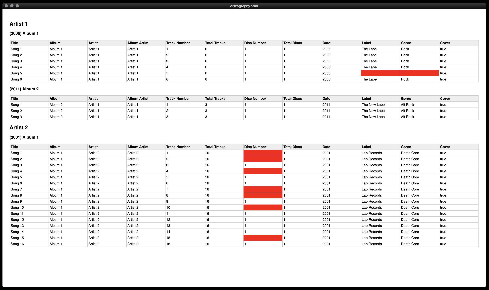

# Taglizer

> Music library tag analyzer

## Contents

- [Rationale](#rationale)
- [Usage](#usage)
- [License](#license)
- [Contacts](#contacts)

## Rationale

I made this small project in a rush. I needed to parse a reasonably large bulk of `.mp3`, `.flac`, and `.opus` to identify any missing tag in the metadata.

Given a very specific folder/file structure:

```
- Discography
  - Artist
    - Album
      - Song (flac|mp3|opus)
      - Song (flac|mp3|opus)
    - Album
      - Song (flac|mp3|opus)
  - Artist
      - Album
      - Song (flac|mp3|opus)
  ... etc
```

Taglizer looks for these tags in the metadata of every file:

```
Title
Album
Artist
Album Artist
Track Number
Total Tracks
Disc Number
Total Discs
Date
Label
Genre
Cover (true or false)
```

The output is `html` based (barebone styling). Any missing tag is highlighted in the _album table_ with a red cell.



### Disclaimer

Feel free to fork and customize these scripts as you see fit, but keep in mind I have no interest in updating them to accommodate for other use cases.

## Usage

Clone and install the dependencies:

```shell
git clone http://github.com/lucaorio/taglizer && cd taglizer
yarn install # or npm install
```

Customize the path (relative, or absolute tilde) to your root directory in `package.json`:

```js
  "config": {
    "root": "~/Discography",
    // ...
  }
```

Run the build script:

```shell
yarn build # or npm build
```

Click the output path generated in the success logs of your cli to open it in the browser:

```shell
HTML generated succesfully at ./output/discography.html
```

## License


---

## Contacts

- 🐦 Twitter [@lucaorio\_](http://twitter.com/@lucaorio_)
- 🕸 Website [lucaorio.com](http://lucaorio.com)
- 📬 Email [luca.o@me.com](mailto:luca.o@me.com)
